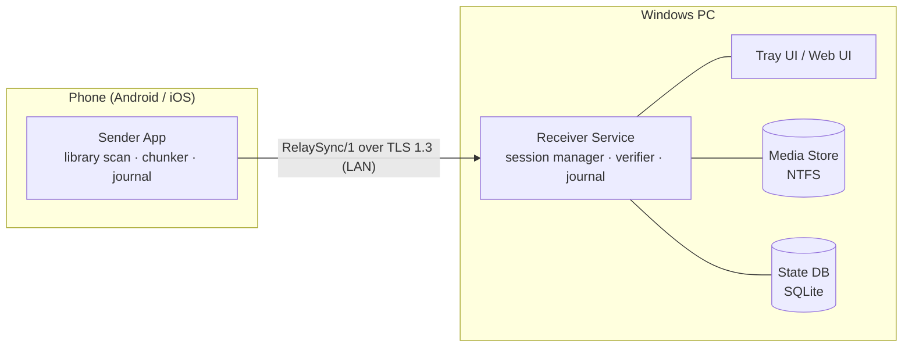
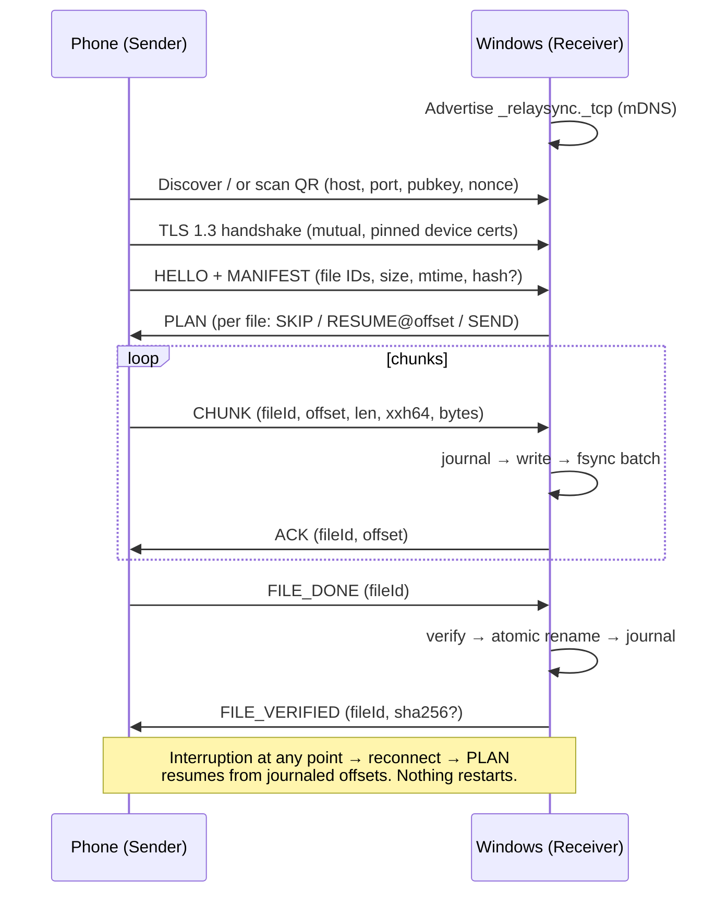

# PhotoRelay — Product Architecture

Version 0.1 · Status: initial design

---

## 1. Overview

PhotoRelay is a system for moving large photo/video libraries from
smartphones to Windows PCs **reliably**. The defining architectural decision:
we do not build on MTP, Windows Explorer, SMB, or any general-purpose file
copy mechanism. We build a purpose-built, fault-tolerant **synchronization
protocol** (RelaySync/1, see [transfer-protocol.md](transfer-protocol.md))
with persistent state on both ends.

> **Transfers can fail. The application must make failure irrelevant.**

Every component is designed around the assumption that connections drop,
apps crash, and machines reboot — in the middle of a 3,000-file transfer.

### Design goals (in priority order)

1. **Correctness** — a file on the PC is either byte-identical to the phone
   original or visibly incomplete. Never ambiguous.
2. **Resumability** — any interruption, at any point, resumes without
   re-transferring verified data.
3. **Simplicity** — the user never manages folders, protocols, or conflicts.
4. **Local-first** — LAN only. No cloud relay, no account, no server.

### Non-goals (v1)

- Cloud backup / off-site sync
- Two-way sync or deletion propagation (PC is an append-only destination)
- macOS/Linux receivers (protocol permits them later)

---

## 2. System components



| Component | Platform | Responsibility |
| --- | --- | --- |
| **Receiver Service** | Windows (service + tray app) | Accepts connections, manages sessions, writes & verifies files, owns the persistent journal and media store |
| **Sender App** | Android, iOS | Scans the media library, builds manifests, chunks files, transfers, retries, resumes |
| **Web UI / Website** | Browser | Product site, onboarding (QR pairing display), docs, live status view |
| **RelaySync/1** | Protocol spec | Shared contract: framing, session lifecycle, manifest, chunk maps, verification, recovery |

The protocol is the product. The three apps are interchangeable
implementations of the same state machine, which is why the specs in
`docs/` come before any native code.

---

## 3. Receiver Service (Windows)

A single executable with three internal modules. Ships as a tray app with an
optional auto-start Windows service later.

### 3.1 Modules

| Module | Responsibility |
| --- | --- |
| **Discovery** | mDNS/DNS-SD advertiser (`_relaysync._tcp.local`), pairing QR generator |
| **Session Manager** | TLS listener, pairing handshake, session state machine, scheduling one active session per device |
| **Transfer Engine** | Frame codec, chunk writer, chunk-map journaling, dedup index lookup, throttling |
| **Verifier** | Per-chunk xxHash64 validation inline; background full-file SHA-256 queue |
| **Store Manager** | Directory layout, `.part` staging area, atomic finalize (rename), filename collision policy |
| **Journal** | SQLite (WAL mode) — every state transition and every received chunk is persisted *before* it is acknowledged |

### 3.2 Why SQLite as the journal

The journal is the heart of resumability. Requirements: atomic writes,
crash-safe, queryable, zero-admin. SQLite in WAL mode with `synchronous=NORMAL`
gives us exactly-once chunk accounting with fsync batches, survives power
loss, and needs no server. Every chunk acknowledgement is preceded by a
journal commit — so after a crash, the journal **never** claims more than
what is durably on disk.

### 3.3 Media store layout

```
<LibraryRoot>/
  <DeviceName>/                 # e.g. "Pixel 8"
    2026/
      2026-08/
        IMG_20240812_103022.jpg
        VID_20240812_104411.mp4
    .photorelay/
      incoming/                 # *.part files, one per in-flight file
      trash/                    # soft-deleted by user, restorable
```

- Files in flight live exclusively in `incoming/` as `<fileId>.part`.
- Finalize = verify → `MoveFile` (atomic, same volume) → journal commit.
- The library only ever contains complete, verified files.

---

## 4. Sender App (Android / iOS)

| Module | Responsibility |
| --- | --- |
| **Library Scanner** | Enumerates photos/videos via MediaStore (Android) / PhotoKit (iOS), produces stable file IDs and metadata |
| **Manifest Builder** | Diff-scan vs. last session; supports "Back up everything" and album/date selection |
| **Chunker** | Streams files in 256 KiB chunks (reads via platform content APIs — never assumes raw filesystem paths) |
| **Session Client** | Discovery (mDNS + QR), pairing, TLS, reconnect loop with exponential backoff |
| **Journal** | SQLite mirror of sent/acked state so the phone also survives crashes mid-transfer |

Platform notes:

- **Android**: foreground service + partial wake lock during transfer;
  MediaStore gives mtime/size without storage permissions on modern API
  levels. HEIC/RAW passed through unmodified.
- **iOS**: PhotoKit asset fetch; BackgroundTasks framework for opportunistic
  continuation; Local Network permission + Bonjour. No background
  guarantees — so the resume protocol does the heavy lifting, exactly as
  designed. HEIC preserved by default; optional JPEG transcode is a
  receiver-side setting, never a silent one.

---

## 5. Communication architecture



Full normative detail in [transfer-protocol.md](transfer-protocol.md).

---

## 6. Modularity & shared code

The protocol concepts are implemented **once per platform** but specified
**once** here. To keep implementations aligned:

| Shared artifact | Form |
| --- | --- |
| Wire format & message schemas | JSON Schema / CBOR CDDL in `docs/transfer-protocol.md` (code-generated constants later) |
| State machine | Single normative state chart; each platform implements it literally |
| Chunk size, hash algorithms, retry policy | Protocol constants table |
| Test vectors | Golden chunk maps, manifests, and transcripts (added with the first implementations) |

A future shared Rust core (framing, chunk maps, verification) with FFI to
Kotlin/Swift/C# is explicitly left open — the specs are written so that such
a core could implement them without protocol changes.

---

## 7. Technology choices

| Layer | Choice | Rationale |
| --- | --- | --- |
| Transport | TCP + TLS 1.3 (LAN) | Ubiquitous, debuggable; QUIC/Multipeer later as pluggable transports |
| Framing | Length-prefixed frames, CBOR payloads | Compact, self-delimiting, schema-evolvable |
| Chunk checksum | xxHash64 | ~10× faster than SHA for inline integrity |
| File verification | SHA-256 (async, optional) | Strong verification on demand |
| Device identity | Ed25519 keypairs, TOFU pinning | Small keys, fast verify, no PKI |
| Discovery | mDNS/DNS-SD + QR fallback | Zero-config on LAN; QR bridges awkward networks |
| Journal / index | SQLite (WAL) | Crash-safe, embedded, cross-platform |
| Windows app | C#/.NET 8 (WinUI 3 tray) or Rust+Tauri — decided at implementation start | Native integration, service support |
| Android | Kotlin (ForegroundService, MediaStore) | Platform-native media access |
| iOS | Swift (PhotoKit, Network.framework) | Platform-native media access |
| Website | React + TypeScript + Vite + Tailwind | This repo's `website/` |

---

## 8. Failure mode analysis

| Failure | Detection | Recovery |
| --- | --- | --- |
| Wi-Fi drops mid-chunk | TLS read timeout / TCP RST | Sender backs off, rediscovers, PLAN resumes from journaled offset |
| Phone app killed | No heartbeat (5 s) | Session → INTERRUPTED; sender journal reopens on relaunch |
| PC app crash | — | Journal replay on startup; `.part` files reconciled against chunk maps |
| PC reboot mid-transfer | — | Same as crash; receiver resumes listener, phone reconnects automatically |
| Disk full | Write error | Session → BLOCKED (not failed); resumes when space frees |
| Duplicate library items | Dedup index (hash + metadata) | Skipped in PLAN, reported as "already backed up" |
| Corrupted chunk | xxHash64 mismatch | Re-request that chunk only, up to N retries |
| Clock skew on mtime | Metadata mismatch tolerance window | Hash verification decides; never silent-skip on mtime alone |

---

## 9. Roadmap

1. **Phase 0 — Design** ✅ this repo's `docs/` + website demo
2. **Phase 1 — Protocol proving ground** ✅ [`relay/`](../relay/) — reference
   receiver (journal + transfer engine + verifier) and CLI sender with
   golden test vectors; e2e + crash-recovery tests prove resume, dedup, and
   verification
3. **Phase 1.5 — Windows tray app** (wraps the proven core; adds mDNS
   discovery, auto-start, notifications)
4. **Phase 2 — Android app**
5. **Phase 3 — iOS app**
6. **Phase 4 — Polish**: background scheduling, selective albums, bandwidth
   limits, NAS destinations
