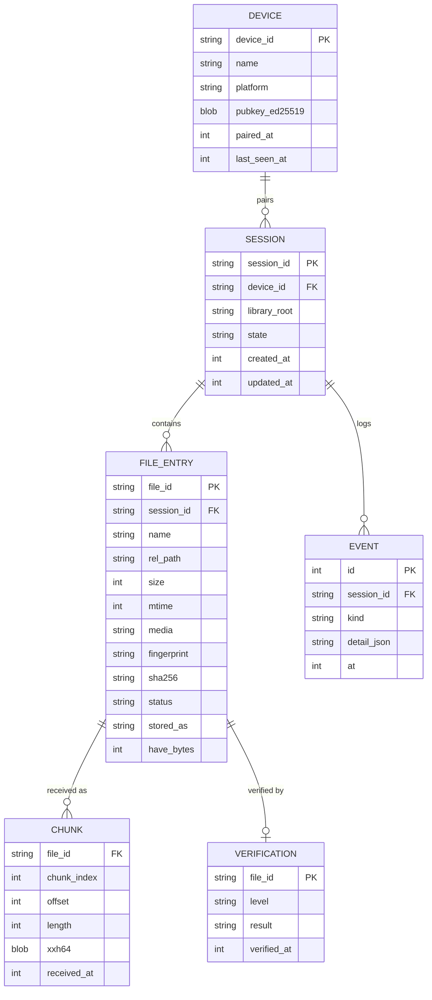

# PhotoRelay — Data Model

Version 0.1 · Status: initial design · Companion to
[transfer-protocol.md](transfer-protocol.md)

---

## 1. Overview

Both ends of a RelaySync/1 session keep persistent state. The **receiver
(PC) journal is authoritative** for what has been stored; the **sender
(phone) journal** remembers what has been acknowledged so reconnection is
cheap. Both are SQLite databases in WAL mode.

Design rules:

- Every entity is keyed by stable IDs, never by file paths.
- Every fact is written before it is relied upon (journal-first ordering).
- All schemas are versioned (`PRAGMA user_version`) and migrated, never
  destructively recreated.

## 2. Entities



### Status lifecycle of a `FILE_ENTRY`

```
planned → transferring → verifying → stored
   │           │             │
   │           └─ interrupted ─┘   (returns to transferring on resume)
   └─ skipped (duplicate / already stored)
   └─ needs_attention (repeated chunk/verify failures)
```

## 3. Receiver schema (SQLite)

```sql
PRAGMA journal_mode = WAL;
PRAGMA synchronous = NORMAL;
PRAGMA user_version = 1;

CREATE TABLE devices (
  device_id        TEXT PRIMARY KEY,          -- fingerprint of Ed25519 pubkey
  name             TEXT NOT NULL,             -- "Pixel 8"
  platform         TEXT NOT NULL,             -- android | ios
  pubkey_ed25519   BLOB NOT NULL,
  paired_at        INTEGER NOT NULL,
  last_seen_at     INTEGER NOT NULL
);

CREATE TABLE sessions (
  session_id       TEXT PRIMARY KEY,          -- UUIDv7
  device_id        TEXT NOT NULL REFERENCES devices(device_id),
  library_root     TEXT NOT NULL,
  state            TEXT NOT NULL,             -- state machine state
  created_at       INTEGER NOT NULL,
  updated_at       INTEGER NOT NULL
);

CREATE TABLE files (
  file_id          TEXT NOT NULL,
  session_id       TEXT NOT NULL REFERENCES sessions(session_id),
  name             TEXT NOT NULL,
  rel_path         TEXT NOT NULL,
  size             INTEGER NOT NULL,
  mtime            INTEGER NOT NULL,
  media            TEXT NOT NULL,             -- photo | video
  fingerprint      TEXT NOT NULL,             -- size+mtime+first1m-xxh64
  sha256           TEXT,                      -- filled post-verification
  status           TEXT NOT NULL,             -- planned|transferring|verifying|stored|skipped|needs_attention|interrupted
  stored_as        TEXT,                      -- final library-relative path
  have_bytes       INTEGER NOT NULL DEFAULT 0,
  updated_at       INTEGER NOT NULL,
  PRIMARY KEY (session_id, file_id)
);
CREATE INDEX files_fingerprint_idx ON files(fingerprint);
CREATE INDEX files_sha256_idx      ON files(sha256) WHERE sha256 IS NOT NULL;

CREATE TABLE chunks (                          -- the chunk map
  file_id          TEXT NOT NULL,
  session_id       TEXT NOT NULL,
  chunk_index      INTEGER NOT NULL,
  offset           INTEGER NOT NULL,
  length           INTEGER NOT NULL,
  xxh64            BLOB NOT NULL,
  received_at      INTEGER NOT NULL,
  PRIMARY KEY (session_id, file_id, chunk_index)
);

CREATE TABLE verifications (
  file_id          TEXT NOT NULL,
  session_id       TEXT NOT NULL,
  level            TEXT NOT NULL,             -- metadata | chunk | sha256
  result           TEXT NOT NULL,             -- pass | fail
  detail           TEXT,
  verified_at      INTEGER NOT NULL,
  PRIMARY KEY (session_id, file_id, level)
);

CREATE TABLE events (                          -- audit/debug log, ring buffer
  id               INTEGER PRIMARY KEY AUTOINCREMENT,
  session_id       TEXT NOT NULL,
  kind             TEXT NOT NULL,             -- state_change|connect|disconnect|error|verify|…
  detail_json      TEXT,
  at               INTEGER NOT NULL
);
```

**Dedup index** = the two partial indexes on `fingerprint` and `sha256`
across *all* sessions for the same library root. Incremental sync and
duplicate detection are the same query.

## 4. Sender schema (SQLite, Android/iOS)

Deliberately minimal — the receiver is authoritative:

```sql
CREATE TABLE transfers (              -- one row per file ever sent
  file_id        TEXT PRIMARY KEY,
  session_id     TEXT NOT NULL,
  size           INTEGER NOT NULL,
  mtime          INTEGER NOT NULL,
  fingerprint    TEXT NOT NULL,
  acked_bytes    INTEGER NOT NULL DEFAULT 0,
  verified       INTEGER NOT NULL DEFAULT 0,   -- FILE_VERIFIED received
  updated_at     INTEGER NOT NULL
);

CREATE TABLE checkpoints (            -- resume bookkeeping
  session_id     TEXT PRIMARY KEY,
  last_ack_at    INTEGER,
  last_manifest  INTEGER,
  backoff_stage  INTEGER NOT NULL DEFAULT 0
);
```

## 5. Media store layout (receiver filesystem)

```
<LibraryRoot>/
  <DeviceName>/
    <yyyy>/<yyyy-MM>/<final files>
    .photorelay/
      incoming/<file_id>.part       -- in-flight only; never shown as complete
      trash/
```

- **`.part` rule:** a file exists outside `incoming/` only after
  verification + atomic rename. Explorer, thumbnail indexers, and backup
  tools therefore never see partial data.
- **Naming collisions:** if `<final name>` exists with identical
  fingerprint → link, don't copy; different content → `name (2).ext`.
- Timestamps (`mtime`) are restored on the final file so gallery apps sort
  correctly.

## 6. Wire-format schemas (JSON equivalents of CBOR payloads)

Normative versions live in [transfer-protocol.md](transfer-protocol.md) §3–5;
this table maps each message to the persisted fields it touches.

| Message | Reads | Writes |
| --- | --- | --- |
| `HELLO` | `devices`, `sessions`, `checkpoints` | `sessions.updated_at`, `events` |
| `MANIFEST` | `files` (dedup index) | `files(status=planned)` |
| `PLAN` | `files`, `chunks` | — |
| `CHUNK_DATA` | `files`, plan cache | `chunks`, `files.have_bytes` |
| `FILE_DONE` | `chunks` | `files(status=verifying)` |
| `FILE_VERIFIED` | `verifications` | `files(status=stored, stored_as, sha256)`, `verifications`, `events` |
| `PAUSE`/`ERROR` | — | `sessions.state`, `events` |

## 7. Capacity expectations

| Scale | Journal impact |
| --- | --- |
| 100k files in one library | `files` ≈ 30 MB; `chunks` rows only exist for in-flight files (deleted after promotion) |
| 4 GB video | 16,384 chunk rows during transfer; purged on promotion |
| Events | ring buffer, last 10k rows per session |

Journal vacuum runs at session completion, never mid-transfer.
