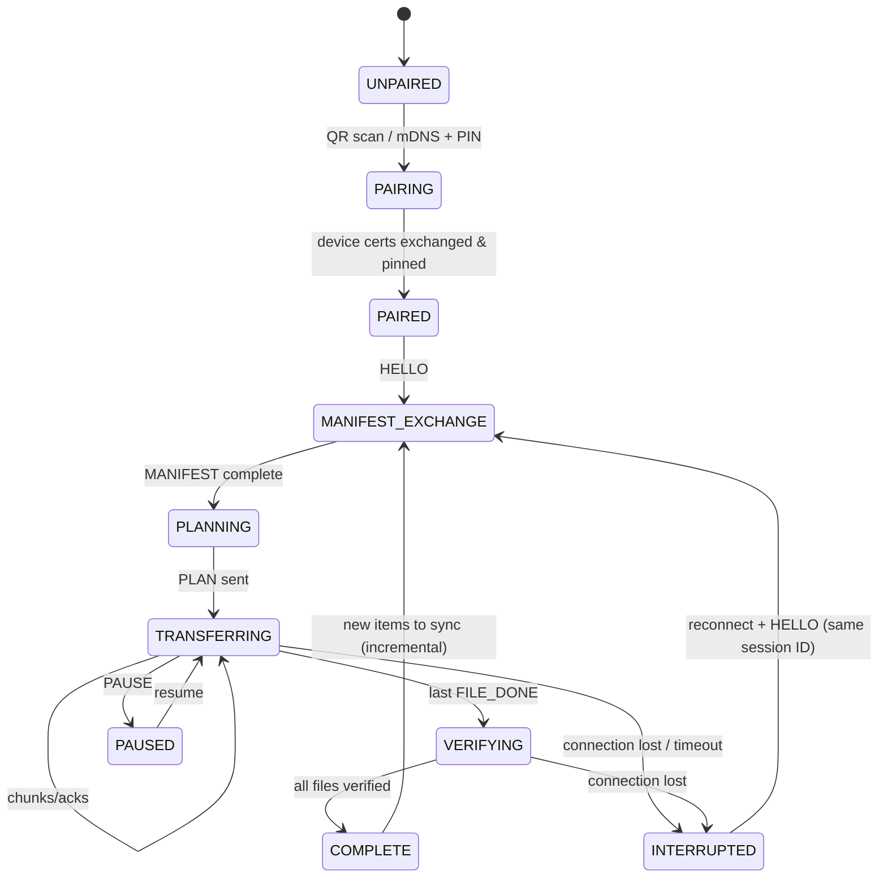
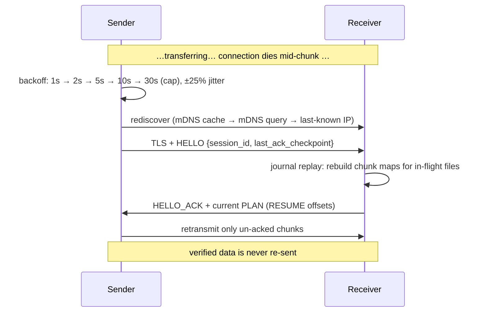

# RelaySync/1 — Fault-Tolerant Transfer Protocol

Version 0.1 · Status: draft specification · Normative for all PhotoRelay clients

---

## 1. Philosophy

> **Transfers can fail. The protocol must make failure irrelevant.**

RelaySync/1 treats interruption as a normal, expected state of every
transfer — not as an error path. The protocol therefore has three
non-negotiable properties:

1. **Persistent state on both ends.** Every fact that matters (what exists,
   what was received, what was verified) is journaled before it is relied
   upon.
2. **Idempotent, resumable operations.** Any message can be re-sent after
   reconnect; any file can resume mid-chunk-stream; restarting an entire
   3,000-file backup is a no-op if the data already arrived.
3. **No ambiguous files.** A partially transferred file is never visible as
   a completed file — it lives in a staging area until verified and
   atomically promoted.

## 2. Terminology

| Term | Meaning |
| --- | --- |
| **Sender** | The phone (data source) |
| **Receiver** | The Windows PC (data sink and authority on stored state) |
| **Session** | One logical transfer relationship between a paired device pair; survives many connections |
| **Connection** | One TLS channel; many connections can serve one session |
| **File ID** | Stable identifier for a media item, scoped to the device (see §6.1) |
| **Chunk** | Fixed-size transfer unit, 256 KiB (262,144 bytes); last chunk of a file may be short |
| **Chunk map** | Bitmap of which chunks of a file the receiver has durably stored |
| **Manifest** | Sender's description of the items selected for transfer |
| **Plan** | Receiver's per-file decision: `SKIP`, `RESUME`, or `SEND` |

## 3. Transport & framing

### 3.1 Transport

- TCP over the local network, TLS 1.3 mandatory (see
  [security-model.md](security-model.md)).
- Receiver listens on an ephemeral port advertised via mDNS and shown in the
  pairing QR code.
- One active connection per session. A new connection for an existing
  session replaces a dead one after `HELLO`.

### 3.2 Framing

Every message is a frame:

```
+----------------+-------------------+----------------------+
| length: uint32 | msg_type: uint8   | payload: CBOR        |
| (big-endian,   | (see table)       | (length - 1 bytes)   |
|  incl. type)   |                   |                      |
+----------------+-------------------+----------------------+
```

Maximum frame size: 4 MiB. Payloads are CBOR maps (RFC 8949); schemas below
are given as JSON equivalents for readability.

Binary chunk data is **not** embedded in CBOR; `CHUNK_DATA` frames carry a
fixed-size header followed by raw bytes (§5.4), so hot-path data is
zero-copy.

### 3.3 Message types

| Type | Code | Direction | Purpose |
| --- | --- | --- | --- |
| `HELLO` | 0x01 | S→R | Open/resume a session on this connection |
| `HELLO_ACK` | 0x02 | R→S | Session accepted; includes session state summary |
| `MANIFEST` | 0x03 | S→R | Describe items to transfer (paginated) |
| `MANIFEST_ACK` | 0x04 | R→S | Manifest page accepted |
| `PLAN` | 0x05 | R→S | Per-file decisions: skip / resume / send |
| `CHUNK_DATA` | 0x06 | S→R | One chunk of one file |
| `CHUNK_ACK` | 0x07 | R→S | Chunk durably stored (journal → disk → ack) |
| `FILE_DONE` | 0x08 | S→R | All chunks of a file sent |
| `FILE_VERIFIED` | 0x09 | R→S | File verified & promoted to library |
| `PAUSE` | 0x0A | either | Graceful pause (user, battery, policy) |
| `RESUME_REQ` | 0x0B | S→R | Request current plan after reconnect (alias: re-`HELLO`) |
| `HEARTBEAT` | 0x0C | both | 5 s liveness; missed 3 → connection dead |
| `ERROR` | 0x7F | either | Structured error (§9) |
| `BYE` | 0x7E | either | Graceful session end |

## 4. Session lifecycle

### 4.1 State machine (both ends implement this literally)



**INTERRUPTED is a first-class state.** It has UI copy, it is journaled, and
exit from it is automatic: the sender reconnects (mDNS rediscovery +
exponential backoff, §8) and re-enters at MANIFEST_EXCHANGE. Because the
receiver's journal is authoritative, a lightweight manifest diff replaces a
full re-scan — incremental sync is the *same code path* as resume.

### 4.2 Session identity

- `session_id`: UUIDv7, minted by the receiver at first pairing of a
  device+library-root pair, persisted on both ends.
- A session is never deleted by interruptions — only by explicit user
  unpairing.
- `HELLO` carries `{session_id, sender_protocol: "RelaySync/1",
  sender_build, last_ack_checkpoint}`.

## 5. Transfer mechanics

### 5.1 File identity (File ID)

```
file_id = sender-scoped stable ID:
  Android: "ms:" + MediaStore ID + ":" + generation
  iOS:     "ph:" + PHAsset.localIdentifier (hashed, stable per device)
fallback (either): "h:" + SHA-256(first 1 MiB ‖ size ‖ name)[:16]
```

The receiver keys its journal by `(device_id, file_id)`. Renames or moves on
the phone do not create duplicates because identity is not the path.

### 5.2 Manifest

Paginated (500 items/page), newest-first:

```json
{
  "type": "MANIFEST", "page": 0, "pages": 7, "selection": "all",
  "items": [{
    "file_id": "ms:1000032142:1",
    "rel_path": "DCIM/Camera/IMG_20240812_103022.jpg",
    "name": "IMG_20240812_103022.jpg",
    "size": 4201187,
    "mtime": 1723459822,
    "media": "photo|video",
    "hash_sha256": null,
    "fingerprint": "size+mtime+first1m-xxh64"
  }]
}
```

`fingerprint` is a cheap, always-computed verifier (size + mtime + xxHash64
of the first 1 MiB). `hash_sha256` is optional and may be computed lazily
(§7.3).

### 5.3 Plan

The receiver answers the full manifest with a plan:

```json
{ "type": "PLAN", "items": [
  { "file_id": "ms:1000032142:1", "action": "SEND" },
  { "file_id": "ms:1000032077:2", "action": "RESUME",
    "have_bytes": 1572864, "chunk_map": "base64…" },
  { "file_id": "ms:1000032001:1", "action": "SKIP", "reason": "duplicate",
    "stored_as": "2026/2026-08/IMG_….jpg" }
]}
```

Decision procedure per item (receiver side):

1. Journal has **verified** entry with matching `fingerprint` → `SKIP`.
2. Journal has **in-flight** entry → `RESUME` with the persisted chunk map.
3. Dedup index match on content hash (if hash present) → `SKIP`, and link
   the new name to the stored file.
4. Else → `SEND`.

### 5.4 Chunks

Chunk size: **262,144 bytes**. `CHUNK_DATA` frame:

```
+----------------+----------+----------+---------+-----------+---------+
| frame header   | file_id  | offset   | length  | xxh64     | bytes…  |
| (type 0x06)    | (16 B    | (uint64) | (uint32)| (uint64)  |         |
|                |  hashed) |          |         |           |         |
+----------------+----------+----------+---------+-----------+---------+
```

Receiver write path, in order:

1. Validate `(file_id, offset, length)` against the plan — reject
   out-of-plan writes.
2. Write bytes into `<incoming>/<file_id>.part` at `offset` (sparse-safe).
3. Record chunk in journal (`chunks` row) — same SQLite transaction as
   the file write's fsync batch.
4. **Only then** send `CHUNK_ACK {file_id, offset}`.

The sender may retransmit any un-acked chunk after reconnect; step 2–3 are
idempotent (same bytes, same offset → same journal row).

Pipelining: up to 16 unacknowledged chunks in flight (4 MiB window).
Receivers advertise `max_in_flight` in `HELLO_ACK`; low-memory builds may
lower it.

### 5.5 File completion

1. Sender: `FILE_DONE {file_id, size, xxh64_full?}`.
2. Receiver checks chunk map completeness + file size.
3. Receiver verifies (§7), then **atomically** renames
   `incoming/<file_id>.part` → final library path (`MoveFile` on the same
   volume; collision policy in [data-model.md](data-model.md)).
4. Journal commit, then `FILE_VERIFIED {file_id, stored_as, sha256?}`.
5. Sender marks the item verified in its own journal.

Until step 4, the file exists **only** as a `.part` file — a partial file
can never be mistaken for a complete one.

## 6. Interruption & recovery

### 6.1 Detection

- `HEARTBEAT` every 5 s; 3 missed → connection considered dead.
- TCP reset / TLS error → immediate.
- Either side may die without any signal; recovery must not depend on clean
  shutdown.

### 6.2 Recovery (the whole point)



- **App crash / OS reboot on either side:** identical flow — both journals
  are on disk, so relaunch restores full context. `.part` files are
  reconciled against chunk maps (size on disk ≥ journaled bytes; any
  mismatch truncates to the journaled state).
- **Mid-chunk interruption:** the partially written chunk is simply absent
  from the chunk map (journal row is written before fsync completes or not
  at all); the sender retransmits that chunk.
- **Duplicate retransmission:** idempotent writes make it harmless.

### 6.3 Nothing restarts

A 3,000-file backup interrupted at file 2,847, byte 41,203,712 of
48,234,667 resumes at exactly that chunk. "Start over" does not exist in
this protocol.

## 7. Verification

Three levels, escalating cost:

| Level | What | When | Cost |
| --- | --- | --- | --- |
| 1 — Metadata | size + mtime + first-1MiB xxHash64 fingerprint | always, in manifest | negligible |
| 2 — Chunk | xxHash64 per 256 KiB chunk | inline during transfer | <1% CPU |
| 3 — Full file | SHA-256 | async after transfer; required only if fingerprint mismatched, user enabled "verify everything", or file flagged | one extra read |

Rules:

- Level 2 failure → re-request that chunk (up to 5 retries, then file marked
  `needs_attention` — never silently accepted).
- Level 3 failure → file stays quarantined in `incoming/`, user notified,
  re-transfer scheduled automatically.
- `SKIP` decisions use Level 1 with a ±2 s mtime tolerance (FAT/EXIF
  roundings); on any doubt, fall through to hash comparison instead of
  skipping.

## 8. Rate, retry & backoff policy (normative constants)

| Constant | Value |
| --- | --- |
| Chunk size | 262,144 B |
| Max in-flight chunks (default) | 16 |
| Heartbeat interval / tolerance | 5 s / 3 missed |
| Reconnect backoff | 1→2→5→10→30 s cap, ±25% jitter |
| Chunk retry limit | 5 per chunk, then `needs_attention` |
| Manifest page size | 500 items |
| Max frame size | 4 MiB |
| Protocol version string | `RelaySync/1` |

## 9. Errors

`ERROR {code, retryable, message, context?}`:

| Code | Meaning | Retryable |
| --- | --- | --- |
| `DISK_FULL` | Receiver out of space | yes (after user frees space) |
| `CHUNK_MISMATCH` | xxHash64 failed | yes (re-send chunk) |
| `VERIFY_FAILED` | SHA-256 mismatch | yes (re-send file) |
| `FILE_GONE` | Source item deleted on phone mid-transfer | no — skip file |
| `PERMISSION_DENIED` | Library access revoked | no — needs user action |
| `UNPAIRED` | Device not paired / unpinned | no — re-pair |
| `PROTOCOL_VIOLATION` | Malformed/out-of-plan frame | no — close connection |
| `BUSY` | Another session active for this device | yes |

`retryable: true` errors leave the session in `INTERRUPTED`/`BLOCKED`;
non-retryable ones surface clear UI copy (see
[ux-design.md](ux-design.md) copy deck) and never corrupt journal state.

## 10. Extensibility

- Version negotiation in `HELLO` (`"RelaySync/1"`); future versions must be
  able to downgrade framing but not journaling semantics.
- Reserved frame type range 0x10–0x6F for extensions (compression,
  live-photo bundles, album metadata).
- Transports are pluggable: anything with reliable ordered bytes + mutual
  auth (QUIC, Bluetooth PAN, USB tethering) can carry the same frames.
